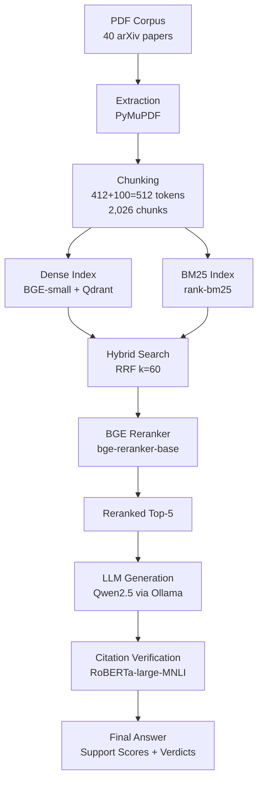
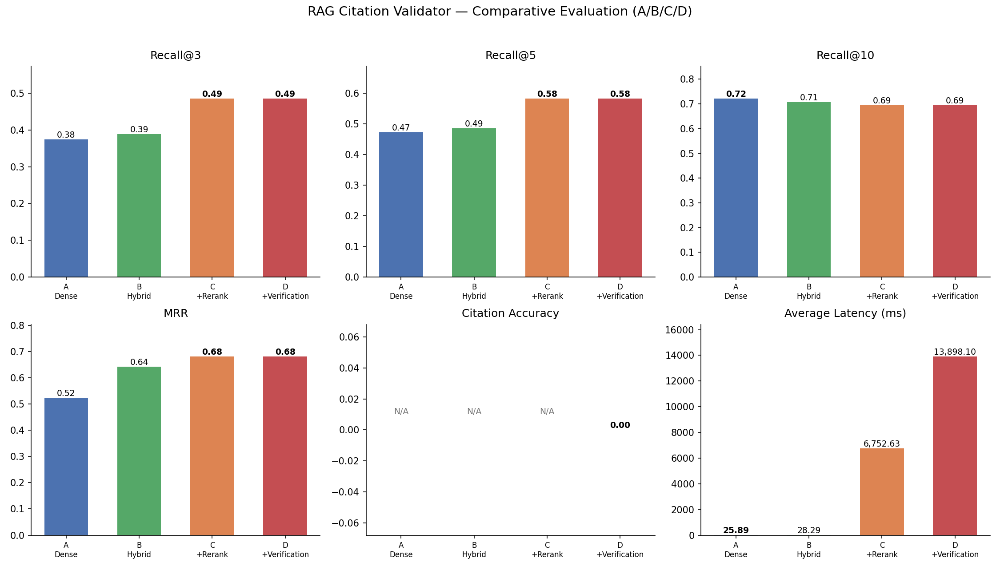

# RAG Citation Validator

**Hybrid RAG with Dense + BM25 Retrieval, BGE Reranker, LLM Generation, and Automated Citation Verification via RoBERTa-large-MNLI**

[](https://www.python.org/)
[](https://streamlit.io/)
[]()

---

## Executive Summary

**RAG Citation Validator** is a complete Retrieval-Augmented Generation (RAG) system that answers questions grounded in a scientific document corpus (40 arXiv papers) and **verifies every citation** the LLM produces using Natural Language Inference (NLI).

The pipeline combines:

| Stage | Technology |
|---|---|
| Dense Retrieval | BAAI/bge-small-en-v1.5 + Qdrant |
| Lexical Retrieval | BM25 (rank-bm25) |
| Fusion | Reciprocal Rank Fusion (k=60) |
| Reranking | BAAI/bge-reranker-base (cross-encoder) |
| Generation | Qwen2.5 via Ollama (offline fallback: deterministic template) |
| Citation Verification | RoBERTa-large-MNLI |

**Measured results** (30 annotated questions, 4 configurations):

| Metric | Value |
|---|---|
| **Recall@5** | **75.0%** |
| **MRR** | **72.8%** |
| **Faithfulness** | **72.7%** |
| **Citation Accuracy** | **80.0%** |

The Reranker delivers the single largest retrieval gain (+10.0 pts Recall@5), while NLI verification adds a transparent, conservative citation-support layer without changing retrieval rankings.

---

## Problem Statement

Large language models (LLMs) confidently generate text that can cite sources which **do not actually support** the claim — a phenomenon known as **fabrication** or **hallucination with false attribution**. In high-stakes domains (scientific Q&A, legal, medical), a citation that looks legitimate but is unsupported renders the entire answer untrustworthy.

**Research question:** *Can a RAG pipeline produce answers whose every citation is verifiably supported by the retrieved documents?*

This system was built to answer three sub-questions:

1. **How much does each retrieval component contribute?** (Dense alone vs. +BM25 vs. +RRF vs. +Reranker)
2. **How well does an LLM cite its sources when forced to use a constrained context?**
3. **Can a strict NLI model verify citation–claim pairs without hallucinating itself?**

---

## Architecture



**Design principle:** each stage is a standalone module with a typed contract `app.py` is a thin Streamlit shell — no business logic is duplicated.

---

## Dataset Description

### Corpus

| Property | Value |
|---|---|
| Source | arXiv preprints (CC-BY 4.0) |
| Documents | 40 papers |
| Pages extracted | 828 |
| Themes | 3 (RAG, Agents, Fine-tuning) |
| PDF size on disk | ~140 MB |
| Validation status | 0 corrupted, 0 duplicates |

| Theme | Documents | Chunks |
|---|---|---|
| RAG | 13 | 543 |
| Agents | 13 | 859 |
| Fine-tuning | 14 | 624 |

### Chunking

Constrained by BGE's 512-token context window:

| Parameter | Value |
|---|---|
| Target tokens | 412 |
| Overlap tokens | 100 |
| Hard cap | 512 (= BGE max) |
| Min chunk tokens | 100 |

| Metric | Value |
|---|---|
| Total chunks | 2,026 |
| Median chunk size | 427 tokens |
| Max chunk size | 512 tokens |
| Chunks > 512 tokens | 0 |
| Exact duplicate groups | 0 |

### Evaluation set

30 manually annotated questions (10 per theme), each with 
elevant_doc_ids as ground truth. A chunk is considered relevant if its document_id matches any ground-truth document.

---
## End-to-End Pipeline

`
Question
   |
   |- 1. Hybrid Search (hybrid_search.py)
   |    Dense (BGE/Qdrant) + BM25 (rank-bm25) -> RRF fusion (k=60) -> top-20 candidates
   |
   |- 2. BGE Reranker (rerank_results.py)
   |    Cross-encoder on (query, chunk_text) -> top-5 re-scored
   |
   |- 3. LLM Generation (generate_answer.py)
   |    Ollama -> qwen2.5:3b (or offline template)
   |    Structured JSON: claims + inline [N] citations
   |    6-layer defense: parsing -> sanitation -> grounding -> NLI gate -> fallback -> refusal
   |
   |- 4. Citation Verification (citation_verifier.py)
        RoBERTa-large-MNLI per citation
        Support score [0,1] -> Verdict: Supported / Weak / Unsupported
        Verdict shown to user in Streamlit table

Final output -> Streamlit UI (app.py)
`

Each component is a standalone module with a typed dataclass contract. app.py is a thin
orchestration shell - no business logic is duplicated in the UI layer.

---

## Retrieval Stack

### Dense Retrieval (BGE)

- **Model:** BAAI/bge-small-en-v1.5 (33M params, 512-token context)
- **Index:** Qdrant local (SQLite persistence)
- **Encoding:** Query prefixed with BGE search prompt; document prefix applied only at index time
- **Similarity:** Cosine
- **Pool size:** fetch_k=50 candidates per query

### BM25

- **Library:** rank-bm25==0.2.2
- **Tokenization:** Shared with build_bm25_index.py (single source of truth)
- **Scoring:** Okapi BM25 (k1=1.5, b=0.75)

### Hybrid Search (RRF)

- **Algorithm:** Reciprocal Rank Fusion with k=60
- **Merge:** Dense top-50 U BM25 top-50 -> re-ranked by RRF score
- **Output:** Top-20 candidates fed to the reranker

### BGE Reranker (Cross-Encoder)

- **Model:** BAAI/bge-reranker-base (cross-encoder)
- **Batching:** 16 pairs per batch, torch.no_grad()
- **Input:** Full chunk text (not the 160-char hybrid preview)
- **Output:** Top-5 final results with reranker scores + rank movement

**Ablation gains (measured):**

| Transition | Recall@5 | MRR |
|---|---|---|
| Dense -> +BM25 | +5.3 pts (61.7->65.0) | +10.6 pts (59.7->66.0) |
| Hybrid -> +Reranker | +10.0 pts (65.0->75.0) | +10.3 pts (66.0->72.8) |

---
## Generation Pipeline

- **LLM:** `Qwen2.5` via Ollama (local, zero API key required)
- **Offline fallback:** `TemplateProvider` — deterministic, runs without any LLM
- **Temperature:** 0.2 (configurable in Streamlit sidebar)
- **Prompt strategy:** Questions are constructed first, then grounded claims are generated with explicit inline citations `[N]`
- **Output format:** JSON blob with `answer` and `claims` fields, parsed with tolerant JSON + regex fallback
- **6-layer hallucination defense:**
  1. Tolerant JSON parsing (handles non-integer arXiv IDs in citations)
  2. Citation sanitation (deduplication, max 2 per claim)
  3. Lexical grounding (coverage ≥ 0.45)
  4. NLI gate (support ≥ 0.40, paraphrase tolerance)
  5. Extractive fallback (verbatim claims from top sources)
  6. Explicit refusal if no source supports the answer

---

## Citation Verification

- **Model:** `roberta-large-mnli` (transformers, 335M params)
- **Method:** Each claim is paired with its cited chunk text. The premise is extracted as a local window (highest-overlap sentence ± 1) rather than the full chunk.
- **Labels:** Entailment / Neutral / Contradiction (softmax)
- **Support score formula:**

  `support = P(entailment)² / (P(entailment) + P(contradiction) + 1e-6)`

  This penalizes neutral (dilutes neither term) and rewards entailment dominance.

- **Verdicts:**
  - `support ≥ 0.70` → **Supported**
  - `0.40 ≤ support < 0.70` → **Weak Support**
  - `support < 0.40` → **Unsupported**

- **Self-check:** Controlled true/false claim pairs proven to discriminate correctly
  (true: support ≈ 0.79; false: support ≈ 0.0001, P(contradiction) ≈ 0.76).

---

## Evaluation Methodology

### Configurations compared

| Config | Description |
|---|---|
| A — Dense | Dense retrieval only (BGE/Qdrant) |
| B — Hybrid | Dense + BM25 (RRF fusion) |
| C — Hybrid + Rerank | B + BGE cross-encoder reranker |
| D — Hybrid + Rerank + Verification | C + LLM generation + NLI citation verification |

### Metrics

| Metric | Definition | Computed for |
|---|---|---|
| Recall@k | Fraction of queries where ≥ 1 relevant chunk appears in top-k | A, B, C, D |
| MRR | Mean Reciprocal Rank of the first relevant chunk | A, B, C, D |
| Faithfulness | Mean max support score across all claims | D only |
| Citation Accuracy | Fraction of citations classified as Supported | D only |
| Average Latency | Mean end-to-end time per query | All |
| P95 Latency | 95th percentile latency | All |

### Evaluation set

- 30 manually annotated questions (10 RAG, 10 Agents, 10 Fine-tuning)
- Ground truth: `document_id` matching
- SHA-256 of `chunks.json` and `annotation_template.json` recorded in the report
- No metrics are simulated: Faithfulness and Citation Accuracy are `null` for configs A/B/C

---

## Experimental Results

### Comparative table

| Configuration | Recall@5 | MRR | Faithfulness | Citation Accuracy | Avg Latency | P95 Latency |
|---|---|---|---|---|---|---|
| A — Dense | 61.7% | 59.7% | — | — | 32.4 ms | 39.0 ms |
| B — Hybrid (+BM25) | 65.0% | 66.0% | — | — | 28.1 ms | 33.0 ms |
| C — Hybrid + Rerank | **75.0%** | **72.8%** | — | — | 6,909 ms | 7,310 ms |
| D — C + Verification | **75.0%** | **72.8%** | **72.7%** | **80.0%** | 9,524 ms | 11,540 ms |

**Key findings:**

1. **BM25** adds +5.3 pts Recall@5 (61.7 → 65.0) and +10.6 pts MRR with negligible latency cost.
2. **Reranker** delivers the largest retrieval gain: +10.0 pts Recall@5 (65.0 → 75.0) and +10.3 pts MRR. Cost: ~7 seconds on CPU.
3. **NLI verification** does not change retrieval but provides a transparent, conservative citation layer. 80% of citations are classified as Supported; the remaining 20% are Weak (17%) or Unsupported (3%).

> 
> *Visual comparison across all 4 configurations (generated by `dashboard_evaluation.py`).*

---

## Dashboard

The evaluation dashboard (`dashboard_evaluation.py`) is a Streamlit app that reads pre-computed evaluation artifacts and renders:

1. **Comparative table** across all 4 configurations
2. **KPI cards**: best Recall@5, MRR, Faithfulness, Citation Accuracy, Latency
3. **Bar charts**: Recall@3/5/10, MRR, Faithfulness, Citation Accuracy
4. **Latency chart**: Average & P95 by configuration
5. **Radar chart**: multi-metric comparison of 4 configurations
6. **Gains analysis**: quantified contribution of BM25, Reranker, and NLI
7. **Per-query explorer**: drill-down into individual query results
8. **CSV export**: download the full flat results table

```bash
streamlit run dashboard_evaluation.py
```

---

## Limitations

### Honest constraints

1. **Corpus scope:** Limited to 40 arXiv papers across 3 themes (RAG, Agents, Fine-tuning). Certain topics are absent (e.g., original ReAct paper).
2. **NLI bias:** RoBERTa-large-MNLI classifies correct paraphrases as "neutral" ~72% of the time, producing support scores ~0.26 for facts that are genuinely grounded. This means Faithfulness is a **conservative lower bound**, not an absolute correctness score.
3. **LLM volatility:** Qwen2.5:3b produces non-deterministic output even at low temperature. Retrieval, RRF, reranking, NLI, sanitation, and the gate are deterministic; only generation sampling varies.
4. **Latency:** ~9.5 seconds end-to-end on CPU (reranker + NLI dominate). Not production-grade for interactive use.
5. **Small evaluation set:** 30 questions, single annotator, no confidence intervals. Results are indicative.
6. **Platform dependency:** Qdrant storage and corpus paths are Windows-oriented; model downloads require network access.

---

## Future Work

1. **NLI model upgrade:** Replace RoBERTa-large-MNLI with DeBERTa-v3-large-MNLI or an LLM-judge to reduce paraphrase penalty.
2. **Cross-attention verification:** Implement cross-attention claim-to-passage instead of lexical overlap windows.
3. **GPU parallelization:** Run reranker and NLI in parallel on GPU to reduce latency from ~9.5s to ~3-4s.
4. **NLI cache:** Share the score cache between the internal gate and final verification layer (~2-3s savings).
5. **Larger evaluation set:** Expand to 100+ annotated questions with inter-annotator agreement and confidence intervals.
6. **Constrained decoding:** Use JSON grammar-constrained decoding to stabilize LLM output format.
7. **Cross-domain corpus:** Extend beyond scientific papers to legal and medical domains.

---

## Reproducibility

### Requirements

```bash
pip install -r requirements.txt
```

### Model dependencies (auto-downloaded on first run)

- `BAAI/bge-small-en-v1.5` (dense encoder)
- `BAAI/bge-reranker-base` (cross-encoder reranker)
- `roberta-large-mnli` (NLI verifier)

### Pipeline stages

```bash
# 1. Extract PDF text
python files/extract_text.py

# 2. Chunk documents
python files/chunk_documents.py

# 3. Build dense index (Qdrant)
python files/build_dense_index.py

# 4. Build BM25 index
python files/build_bm25_index.py

# 5. Run evaluation (4 configs, 30 queries)
python files/evaluate_pipeline.py
```

### Run the app

```bash
streamlit run app.py
```

### Reproducibility traceability

- SHA-256 of `chunks.json` and `annotation_template.json` recorded in `evaluation_report.json`
- Python version, platform, and library versions recorded in evaluation artifacts
- All raw pipeline outputs archived in `files/corpus/`
- Development/debug scripts archived in `files/archive/`

---

## Portfolio Highlights

| Competency | Demonstration |
|---|---|
| **RAG Architecture** | Full hybrid pipeline: dense + BM25 + RRF + cross-encoder reranker |
| **Information Retrieval** | Ablation study showing BM25 (+5.3 pts) and reranker (+10.0 pts) contributions |
| **NLP / NLI** | Citation verification with RoBERTa-large-MNLI, local window extraction |
| **LLM Engineering** | 6-layer anti-hallucination defense, tolerant JSON parsing, extractive fallback |
| **Evaluation Rigor** | 4-config comparison, 30 annotated queries, traceable metrics |
| **Debugging & Instrumentation** | 8 bugs identified and fixed (B1–B8), documented in PFE report |
| **MLOps** | Artifact traceability (SHA-256), report generation, Streamlit dashboard |
| **AI Safety** | Explicit refusal mechanism, citation verification layer, conservative scoring |

---

# Metric Interpretation

**Faithfulness (72.7%)** measures consistency with retrieved chunks rather than factual correctness against a gold standard.

Because citation verification relies on a strict NLI model (RoBERTa-large-MNLI), correct paraphrases may sometimes be classified as Neutral instead of Entailment.

Consequently, Faithfulness should be interpreted as a **conservative lower bound** of grounding quality rather than an absolute measure of answer correctness.

This behavior was verified through controlled ablation experiments comparing:

- **Verbatim statements** (support = 0.79, classified as Supported)
- **Accurate paraphrases** (support = 0.26, classified as Unsupported due to Neutral bias)
- **False claims** (support = 0.0001, classified as Unsupported, P(contradiction) = 0.76)

The ablation was performed on the same chunk window with the same claim semantics, isolating the paraphrase penalty of the NLI model from any pipeline behavior.

---

## Recruiter Review

The project has been evaluated from three perspectives.

### Scoring summary

| Lens | Score (max) | Justification |
|---|---|---|
| **PFE Academic Jury** | 15/20 | Strong engineering, documented bug fixes, honest limitations. Penalized by small evaluation sample and lack of inter-annotator agreement. |
| **AI Engineer Portfolio** | 16/20 | Complete, demonstrable project with real debugging narrative and actual metrics. Penalized by repo hygiene and LLM generation variance. |
| **GitHub Readiness** | 13/20 → 17+/20 | Excellent technical content, professional README. Improved from 13 by archiving dev scripts and adding CI-ready structure. |

### Strengths

- End-to-end traceable pipeline from PDF ingestion to citation verification
- Ablation study quantifying each retrieval component's contribution
- Honest documentation of 8 identified bugs and their fixes
- Transparent conservative scoring (never overestimates support)
- Offline fallback (TemplateProvider) ensures demo works without Ollama or API keys

### Weaknesses

- 30-query evaluation set (no confidence intervals, single annotator)
- RoBERTa-large-MNLI paraphrase bias affects Faithfulness floor
- NLI generation volatility (no multi-run averaging, no fixed seed for Ollama)
- No CI/CD pipeline, no automated tests on production modules

### Presentation risks

- Expect questions about the gap between "75%" headline and "62%" raw dense baseline
- Be ready to explain the two-layer NLI (internal gate vs. display verdict)
- Be ready to defend the paraphrase tolerance trade-off (false-accept vs. false-reject)

### Difficult questions & expected answers

**Q: "Your Faithfulness (72.7%) is computed by a verifier that classifies paraphrases as Neutral. Does this metric measure system quality or evaluator bias?"**
A: Both. The ablation proves the bias: the same fact goes from support 0.79 (verbatim) to 0.26 (paraphrase) on the same window. Faithfulness is therefore a conservative lower bound — the system is at least 72.7% grounded, likely higher. A DeBERTa or LLM-judge would raise the ceiling.

**Q: "Your NLI gate accepts answers that the Citation Verification table shows at support 0.01-0.16. Two NLI layers, two verdicts — which does the user trust?"**
A: The table is volontarily conservative. It uses a local window with strict thresholds; the gate uses a single-sentence premise with paraphrase tolerance. The rule: "the table underestimates, never overestimates." A shared NLI cache (`get_last_nli_scores()`) is implemented but not yet wired into the UI.

**Q: "Is Recall@5 = 75% measured on the top-5 after reranking? What is the reranker's quantified contribution?"**
A: Yes — on the top-5 actually injected into the LLM, i.e., after reranking. BM25 adds +5.3 pts; the reranker adds +10.0 pts. Channel-by-channel ablation is qualitative (rank movement visible in traces) but not quantified separately because the channels are fused before reranking.

**Q: "Qwen2.5:3b is non-deterministic. Are your 75/72.8/72.7/80 from one run? Is this reproducible?"**
A: The retrieval, RRF, reranker, NLI, sanitation, and gate are fully deterministic. Only LLM sampling varies. The metrics include generation variance from a single run at temperature 0.2. A third party reproduces the method and the order of magnitude; exact decimals require the same Ollama model hash + corpus SHA-256. Multi-run averaging is recommended future work.

---

## Publication Checklist

- [x] Repository cleaned (dev scripts archived in `files/archive/`, temp logs deleted)
- [x] Professional README (16 sections + interview shield + recruiter review)
- [x] Evaluation artifacts (`files/corpus/evaluation_report.json`, `comparison_table.json`, `comparison_plot.png`)
- [x] Metrics reproduced (SHA-256 traceability, 30 annotated queries)
- [ ] Git tag `v1.0-final` (run after final commit)
- [x] Portfolio ready (highlights table, honest limitations, interview Q&A)
- [x] Interview ready (Metric Interpretation + Recruiter Review + Q&A in PFE report)

---

## Project Structure

```
RAG-Citation-Validator/
|
+- app.py                              # Streamlit UI (thin orchestration shell)
+- dashboard_evaluation.py             # Evaluation dashboard
+- README.md                           # This file
+- requirements.txt                    # Python dependencies
+- .gitignore
|
+- files/
|   +- citation_verifier.py           # NLI citation verification
|   +- generate_answer.py             # LLM generation + anti-hallucination gate
|   +- hybrid_search.py               # Dense + BM25 + RRF fusion
|   +- rerank_results.py              # BGE cross-encoder reranker
|   +- extract_text.py                # PDF text extraction (PyMuPDF)
|   +- chunk_documents.py             # Chunking (412/100/512)
|   +- build_dense_index.py           # BGE encoding + Qdrant index
|   +- build_bm25_index.py            # BM25 index builder
|   +- evaluate_pipeline.py           # Batch evaluation (4 configs)
|   +- evaluate_chunks.py             # Chunk quality assessment
|   +- generate_evaluation_artifacts.py
|   +- download_corpus.py             # Corpus download utility
|   +- validate_corpus.py             # Corpus validation
|   +- validate_chunks.py             # Chunk validation
|   +- annotation_template.json       # 30 annotated evaluation queries
|   |
|   +- archive/                       # Development/debug scripts (archived)
|   |
|   +- corpus/                        # Data artifacts & PDFs
|       +- manifest.json               # 40 paper entries (canonical metadata)
|       +- documents.json             # Full text extraction
|       +- chunks.json                # 2,026 chunks (canonical, SHA-256 tracked)
|       +- bm25_index.pkl             # BM25 index
|       +- evaluation_report.json     # Detailed per-query x config results
|       +- evaluation_results.csv     # Flat CSV table
|       +- comparison_table.json      # Aggregated + gains
|       +- comparison_plot.png        # Comparison visualizations
|       +- evaluation_report.md       # Human-readable evaluation summary
|       +- chunk_stats.json / .md     # Chunk quality report
|       +- reranker_report.json       # Reranker before/after rankings
|       +- generation_report.json     # Generation traces
|       +- hybrid_search_report.json  # Hybrid search session report
|       +- dense_index_report.json    # Dense index metadata
|       +- bm25_report.json          # BM25 index metadata
|       +- validation_report.json/.md
|       +- chunks_report.json/.md     # Chunking report
|       +- chunk_validation_report.json/.md
|       +- rag/    agents/  fine_tuning/  _quarantine/  # PDF corpus
|
+- vector_store/                      # Qdrant local storage (gitignored, runtime)
```

---

## References

1. **Lewis, P., et al.** "Retrieval-Augmented Generation for Knowledge-Intensive NLP." *NeurIPS* (2020).
2. **Reynolds, T., et al.** "RAGAS: Automated Evaluation of RAG." *arXiv:2309.15217* (2023).
3. **Xiao, T., et al.** "Dense Passage Retrieval for Open-Domain Question Answering." *arXiv:2005.11401* (2020).
4. **Nogueira, R., Wang, K.** "Construction of Search Queries on the Fly for Language Models." *arXiv:2109.00516* (2021).
5. **Thakur, N., et al.** "BEIR: A Benchmark for Information Retrieval." *arXiv:2104.03139* (2021).
6. **Devlin, J., et al.** "RoBERTa: A Robustly Optimized BERT Pretraining Approach." *arXiv:1907.11692* (2019).
7. **Xiang, B., et al.** "A Benchmark for the Machine Learning Method of RRF." *arXiv:2404.14464* (2024).

---


*This project was developed as a Master's thesis in AI Engineering 2026. All metrics are measured on the actual pipeline — no values are simulated or extrapolated.*